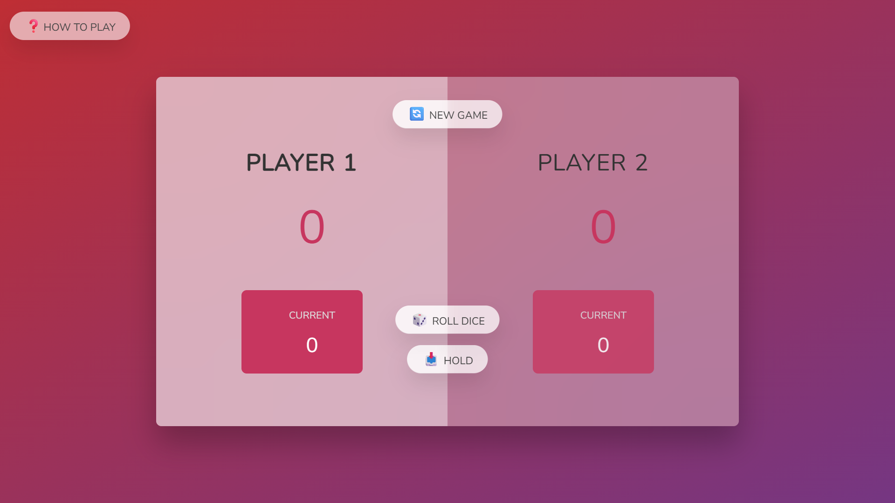

# Pig Dice Game – 2 Player Desktop Game 🎲

**Pig Dice Game** is a simple and addictive two-player desktop game built using **HTML**, **CSS**, and **JavaScript**.

The goal? Be the first to reach a **total score of 100** by rolling the dice. But be careful—rolling a **1** ends your turn and resets your current round score!

🔗 **Check out the [live demo](https://bahareh-bahrami.github.io/Pig-Game/) of the application.**

---

## Technologies Used

- **HTML5**
- **CSS3**
- **JavaScript (ES6+)**
- Custom **modal window** with transition effects

---

