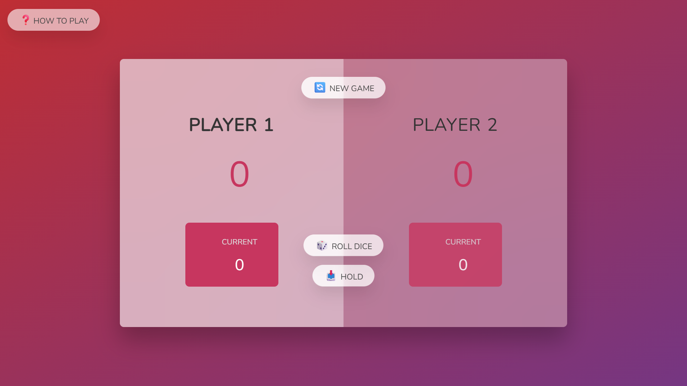
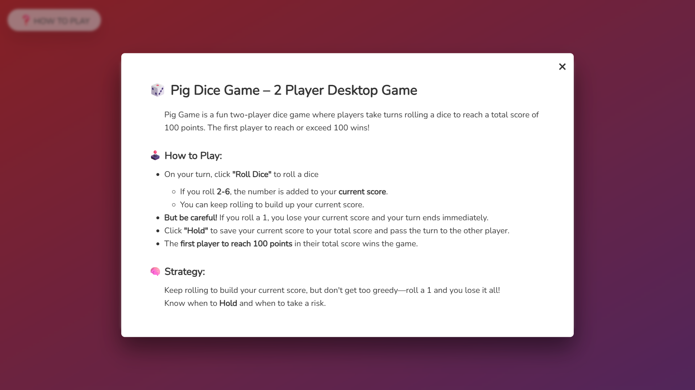

## Pig Dice Game – 2 Player Desktop Game 🎲

**Pig Dice Game** is a simple and addictive two-player desktop game built using **HTML**, **CSS**, and **JavaScript**.

The goal? Be the first to reach a **total score of 100** by rolling the dice. But be careful—rolling a **1** ends your turn and resets your current round score!

🔗 **[Click here to view the live project](https://bahareh-bahrami.github.io/Pig-Game/)**

---

### 🚀 Features

- Simple and semantic HTML structure  
- Interactive two-player dice game with turn-based logic  
- Modal window with gameplay instructions  
- Smooth transitions for showing/hiding modal  
- Responsive and accessible design

---
  
### 🛠️ Technologies Used

- **HTML5**
- **CSS3**
- **JavaScript (ES6+)**
- Custom **modal window** with transition effects

---

### 📚 What I Learned 

- Implementing game logic using JavaScript and DOM manipulation  
- Creating responsive and accessible layouts with modern CSS  
- Structuring modular, semantic HTML for clarity and maintainability  
- Using transitions and class toggling for smooth UI interactions

---

